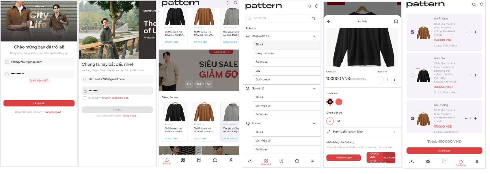
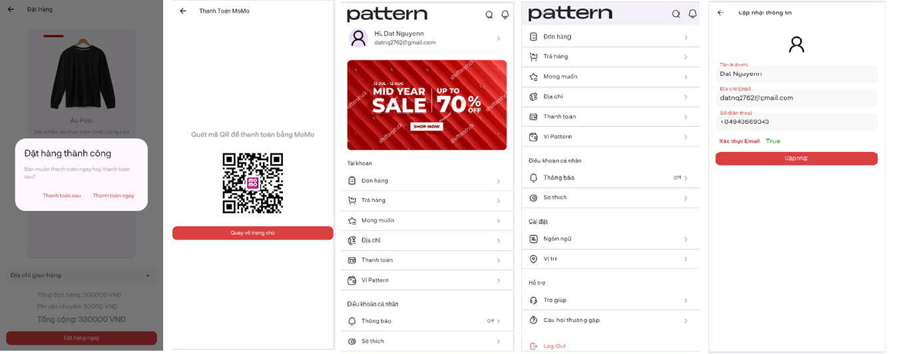

# 🛍️ clothes_app

ĐỒ ÁN TỐT NGHIỆP CÁ NHÂN CỦA TÔI

Một dự án Flutter mới dành cho ứng dụng mua sắm quần áo.

## 🚀 Giới thiệu

**clothes_app** là điểm khởi đầu cho một ứng dụng Flutter, tập trung vào giao diện người dùng hiện đại và trải nghiệm mua sắm mượt mà.

## 📸 Giao diện người dùng

Dưới đây là hình ảnh minh họa giao diện của ứng dụng:

> *Ảnh được lưu trong thư mục `UI`.*

## 🧰 Bắt đầu

Nếu bạn mới bắt đầu với Flutter, đây là một số tài nguyên hữu ích:

- [Lab: Viết ứng dụng Flutter đầu tiên](https://flutter.dev/docs/get-started/codelab)
- [Cookbook: Các mẫu Flutter hữu ích](https://flutter.dev/docs/cookbook)

## 📚 Tài liệu

Để tìm hiểu thêm về Flutter, hãy truy cập [tài liệu chính thức](https://flutter.dev/docs), nơi cung cấp hướng dẫn, ví dụ, và tài liệu API đầy đủ.
